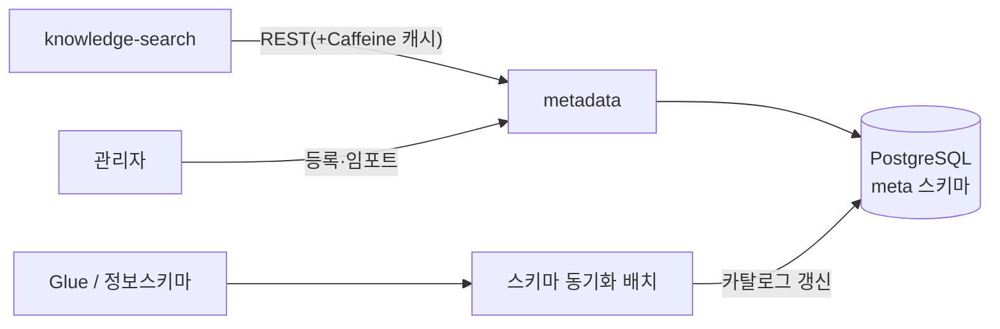
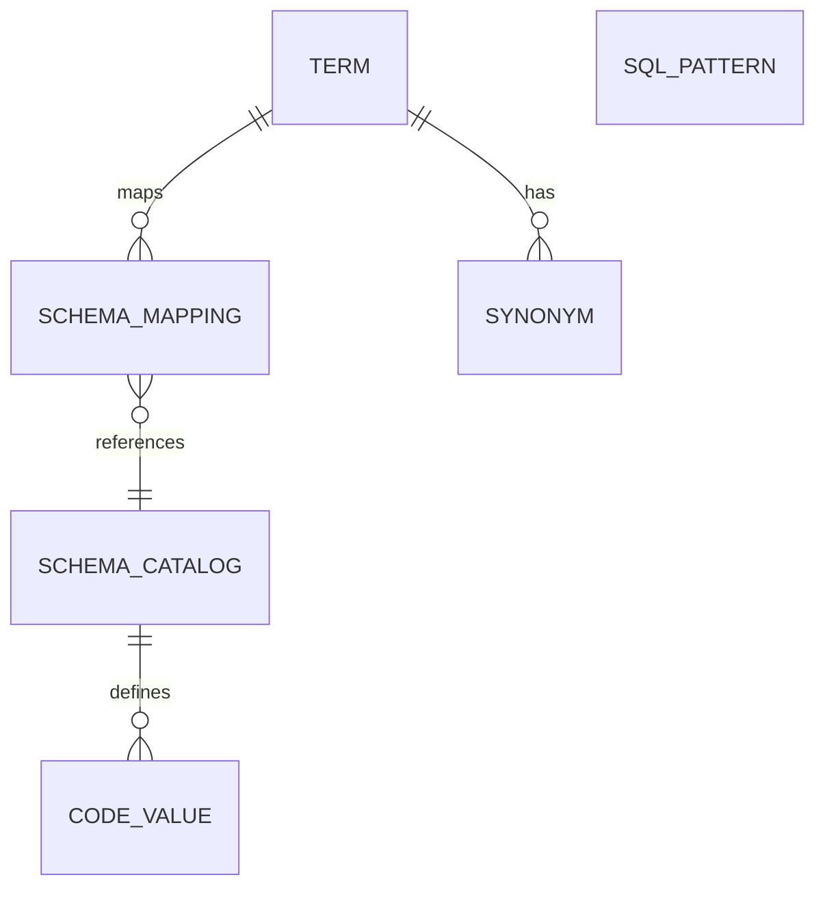
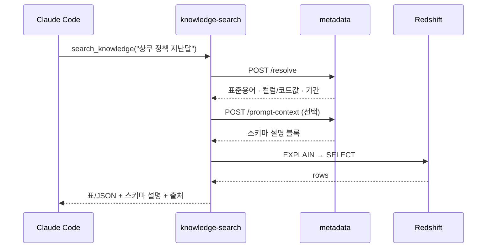

# 경량 온톨로지 기반 메타데이터 레이어 — 설계 PRD

> **Version**: v1.1.0
> **작성일**: 2026-06-07
> **프로젝트**: `metadata-ontology`
> **역할**: 도메인 용어와 물리 스키마를 잇는 공유 메타데이터 계층. 자연어 질의를 물리 컬럼·코드값으로 매핑하고, LLM에 줄 스키마 설명을 만들어 잘못된 해석을 줄인다.
> **스택**: Java 21 · Spring Boot 3.5.x · JPA · QueryDSL · H2(local 시드) / PostgreSQL(운영 예정, TODO(AWS)) · Caffeine(소비자 캐시)
> **연관 문서**: `knowledge-search/.claude/docs/prd-knowledge-search.md`

---

## 1. 무엇을, 왜

같은 개념을 팀마다 다르게 부른다. "상품쿠폰"을 누구는 "상쿠"라 하고, 물리 테이블에는 `code_type='PRODUCT_COUPON'`으로 들어가 있다(설명용 가상 예 — 시드 사전은 정산 도메인: '미정산'→settlement_status=PENDING). 이 간극을 메우지 않으면 SQL 검색 계층과 LLM이 서로 다른 걸 가리키고, 답이 어긋난다. 이 서비스는 그 사이를 잇는 단일 기준(SSOT)을 둔다.

### 1.1 목표
- 도메인 용어와 물리 스키마를 연결한 **공유 메타데이터 계층**을 둬서, SQL 검색 계층(P1)과 LLM이 같은 걸 가리키게 한다.
- **동의어 사전**으로 자연어 키워드를 실제 물리 컬럼·코드값에 매핑해 검색 정확도와 재현율을 올린다.
- 질의에 맞는 스키마 설명을 LLM에 먼저 줘서 **정의된 매핑 안에서 해석하도록 유도하고 임의 해석을 완화한다.** (프롬프트 주입은 유도이지 강제 차단이 아니다 — §6)

### 1.2 비목표
- OWL/RDF 추론 엔진 같은 무거운 온톨로지 — "경량" 사전·규칙으로 한정.
- SQL 조립·실행·랭킹 — 그건 P1 몫이다. 여기서는 매핑·패턴까지만 준다.

### 1.3 규모 (시드 실측치)
- 도메인 용어 **184개** · 물리 스키마 매핑 **152건** · 동의어 292개 · 스키마 카탈로그 123컬럼(8테이블) · 코드값 96개 · SQL 패턴 34건.
- `src/main/resources/seed/settlement/*.csv` 로 적재하며, 수치 하한·상호참조 무결성은 `SeedDictionaryIntegrityTest` 가 강제한다.
- 카탈로그 컬럼 수(123)와 매핑 수(152)는 별개 수치다 — 한 용어가 여러 컬럼에 걸리는 다중 매핑(예: "가맹점" → 8개 테이블의 merchant_id)이 있어 매핑이 더 많다.

---

## 2. 아키텍처 / 역할 경계



- **독립 Spring Boot 서비스.** P1은 REST로 부르고, 잘 안 바뀌는 사전은 P1 쪽 Caffeine 캐시에 둬서 자주 부르는 구간의 지연을 줄인다.
- 사전 데이터는 PostgreSQL의 새 `meta` 스키마에 둔다(`hris` 재사용 여부는 §9).
- 역할 경계: metadata는 **"무엇을 어떤 컬럼·코드값으로 볼지"**(매핑·정규화·설명)까지. **SQL 조립·실행·랭킹은 P1.**

---

## 3. 데이터 모델

기존 컨벤션을 따른다: `BaseEntity` 상속, `@Where(clause="deleted_at IS NULL")` 소프트삭제, `@Builder`, 한글 Javadoc, `@Data` 금지. 패키지는 `com.hris.metadata.domain.<도메인>`, 조회는 QueryDSL 커스텀 리포지토리. 루트 간 참조는 ID 로만 한다(객체 참조 금지 — CLAUDE.md).



| 엔티티 | 핵심 필드 | 설명 |
|---|---|---|
| `Term` | id, canonicalName, domain, definition, status | 표준 도메인 용어 |
| `Synonym` | id, termId, surface, type(약어/한영/오타/구어) | 다양한 표현을 표준 용어로 |
| `SchemaCatalog` | id, physicalTable, physicalColumn, dataType, description, sourceSystem | 물리 테이블·컬럼 정보(Redshift/Glue와 동기화) |
| `SchemaMapping` | id, termId, schemaCatalogId, mappingType, codeValueRule | 용어와 물리 컬럼 연결 |
| `CodeValue` | id, schemaCatalogId, code, label, synonyms | 코드값 사전(예: 재직상태) |
| `SqlPattern` | id, triggerKeywords, columnTarget, operator, valueTemplate, priority | 키워드를 컬럼·연산자·값에 매핑하는 규칙 |

> 용어↔물리 컬럼의 다대다는 **단일 조인 엔티티 `SchemaMapping`** 하나로 표현한다(별도 `TermSchemaMap` 없음 — CLAUDE.md "매핑 모델"). 한 용어가 여러 컬럼에, 한 컬럼이 여러 용어에 걸린다. `SqlPattern` 은 키워드 기반 독립 규칙으로 `Term` 을 참조하지 않는다.

---

## 4. 매핑·확장 API

| API | 입력 | 출력 | 설명 |
|---|---|---|---|
| `POST /api/resolve` | `query`, `domain?` | 표준용어·동의어확장·컬럼/코드값·기간 | **P1이 주로 부르는 한 방 호출** |
| `GET /api/admin/terms/{termId}/mappings` | termId | 물리 컬럼·코드값 매핑 | 용어 단건 조회 |
| `POST /api/expand` | `query` | 동의어를 펼친 질의 | "상쿠"→"상품쿠폰" |
| `POST /api/match-sql-pattern` | `keywords` | 컬럼·연산자·값 후보 | 패턴 매칭 |
| `POST /api/normalize` | `query` | 기간·작성자·대상 정규화 결과 | "지난달"→실제 기간 |
| `POST /api/prompt-context` | `query`/`terms` | LLM에 줄 스키마 설명 블록 | 잘못된 해석 완화(§6) |
| `GET /api/admin/evaluation/recall` | `referenceDate?` | BASELINE vs FULL 재현율 리포트 | 동의어 계층 기여 측정(§8) |

### 4.1 `/resolve` 응답 예시

(설명용 가상 예 — 시드 사전은 정산 도메인: '미정산'→settlement_status=PENDING)

```json
{
  "normalizedQuery": "상품쿠폰 정책 2026-05-01~2026-05-31",
  "terms": [{"canonical": "상품쿠폰", "matchedSurface": "상쿠"}],
  "columnMappings": [
    {"physicalTable": "knowledge_record", "physicalColumn": "code_type", "codeValue": "PRODUCT_COUPON"}
  ],
  "timeRange": {"from": "2026-05-01", "to": "2026-05-31"},
  "unmapped": []
}
```

---

## 5. 관리 API + 거버넌스

- 사전 등록·수정·삭제와 변경 이력(소프트삭제).
- 새 매핑·변경은 검토 후 활성화한다(`status`). (상태값의 조회 경로 반영 필터는 후속 — 현재 resolve/expand 는 상태 무관 조회)
- 팀별 용어·동의어·매핑을 시트/CSV로 한 번에 올린다.
- 사전이 바뀌면 P1 캐시를 무효화하도록 신호를 보낸다(버전 헤더 또는 이벤트). (설계 — 미구현, 현재는 P1 캐시 TTL 에 의존)

---

## 6. LLM에 줄 스키마 설명 만들기

질의에 걸리는 스키마 정의·코드값·용어 설명을 모아, LLM 컨텍스트에 넣을 짧은 안내문으로 만든다.
(아래는 설명용 가상 예 — 시드 사전은 정산 도메인: '미정산'→settlement_status=PENDING)

```
[검색 가능한 스키마]
테이블: knowledge_record
- code_type: 코드 유형 (PRODUCT_COUPON=상품쿠폰, CART_COUPON=장바구니쿠폰)
- updated_at: 최종 수정일 ("최신/최근"이 가리키는 컬럼)
[표준 용어]
상품쿠폰 = 상품에 적용되는 쿠폰 (동의어: 상쿠)
```

이렇게 주면 LLM이 정의된 매핑 안에서 답하도록 유도되어, 컬럼 의미를 임의로 지어낼 여지가 줄어든다. 프롬프트 주입은 환각을 **완화**하는 수단이지 완전히 차단하지는 못한다 — 그래서 P1이 실제 조회 결과(근거)를 함께 제공한다.

---

## 7. 품질 / 정합성

| 항목 | 방법 |
|---|---|
| 매핑 커버리지 | 전체 질의 중 매핑에 성공한 비율을 본다 |
| 미매핑 수집 | `/resolve`의 `unmapped` 키워드를 모아 사전 보강 목록으로 |
| 스키마 불일치 | `SchemaCatalog`와 실제 Redshift/Glue 스키마를 주기적으로 비교해 어긋나면 알린다 |
| 동의어 충돌 | 한 표현이 둘 이상의 표준 용어에 걸리면 경고하고 우선순위로 정리한다 |

---

## 8. 재현율·정확도 측정 (구현됨)

- 정답셋 60문항(`src/main/resources/evaluation/gold_queries.csv`)으로 **동의어·정규화 적용 전(BASELINE)/후(FULL)의 재현율을 비교한다.** 두 arm 모두 동일한 `ResolveService` 경로를 타며 `ResolveOptions` 토글만 다르다.
- 산식(micro/macro recall · 코드값 적중률 · 기간 인식률 · 매핑 커버리지)과 결과 스냅샷은 `docs/evaluation-recall.md` 참조. 실측: BASELINE micro recall 0.3438 → FULL 1.0 (시드·정답셋 기준).
- 실행: `./gradlew test --tests '*RecallEvaluationIntegrationTest'` (회귀 게이트 + `build/reports/evaluation/recall-report.md` 생성) 또는 `GET /api/admin/evaluation/recall`.
- 매핑을 쓴 검색과 안 쓴 검색을 P1 의 채점 점수(judgedScore)와 함께 보는 엔드투엔드 평가는 후속 과제(P1 범위).

---

## 9. 구현 전에 확정할 것

- 사전을 새 `meta` 스키마에 둘지, 기존 `hris`를 쓸지.
- 스키마 카탈로그 동기화 출처: Glue API vs Redshift `information_schema`(또는 둘 다).
- 캐시 무효화 방식: 버전 헤더 폴링 vs 이벤트(SQS).
- 동의어 사전 초기 데이터를 어디서 가져올지.

---

## 10. 로컬 / 배포

| 항목 | 값(제안) |
|---|---|
| 포트 | 8096 |
| 헬스 | `/health`, `/management/health/liveness` |
| 환경변수 | `DB_HOST/PORT/NAME/USER/PASS`, `GLUE_DATABASE`, `AWS_REGION` |
| 배포 | 기존 Jenkins Blue/Green 흐름 |

---

## 부록 A. P1 ↔ P2 흐름



> P1 문서 §6의 흐름과 같다. P1이 정규화·매핑을 P2에 맡기고, 받은 결과로 QueryDSL을 조립해 Redshift에 질의한다.

## 부록 B. 따르는 컨벤션
- 패키지·리포지토리 패턴, 엔티티 규칙, DTO(코드 우선 Swagger), 빌드(Gradle/Java21/QueryDSL 5.1.0)는 `medi-hris-backend-2.0`을 따른다.
- 새 도메인은 `JpaConfig`의 `@EntityScan`/`@EnableJpaRepositories`에 등록한다.
- 참조: `medi-hris-backend-2.0/src/main/java/com/hris/medi/global/config/jpa/JpaConfig.java`, `.../domain/personnel/repository/custom/impl/EmployeeRepositoryCustomImpl.java`
