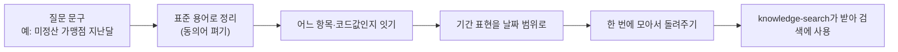

# metadata-ontology

사람이 쓰는 말과 데이터베이스 사이를 이어주는 '용어 사전' 서비스예요. "미정산"이나 "지난달" 같은 표현을 표준 용어와 실제 데이터 항목, 날짜 범위로 바꿔줘요. 형제 서비스인 knowledge-search가 검색에 들어가기 전에 질문을 제대로 알아듣도록 거들어 줘요.

이 문서는 이 서비스가 무엇을 하고 어떻게 짜여 있는지 한 바퀴 둘러봐요.

<br>
<br>

## 한눈에 — 어떻게 동작하나

질문 문구가 들어오면 표준 용어로 정리하고, 그게 어느 데이터 항목·코드값에 해당하는지 이어 줘요. "지난달" 같은 말은 실제 날짜 범위로 바꾸고요. 이 모두를 **한 번의 호출로 모아서** 돌려줘요.

직접 데이터베이스를 뒤지거나 검색을 실행하진 않아요. 그 일은 결과를 받아 가는 쪽(knowledge-search)의 몫이에요. 이 서비스는 "이 말은 이런 뜻이고, 여기에 해당해요"까지만 알려줘요.



<br>
<br>

## 무엇으로 이뤄져 있나

**사전 내용**

정산 도메인에서 쓰는 말들을 정리해 담아 둬요.

- 표준 용어 — 같은 뜻의 여러 표현을 하나의 정식 이름으로 모아요.
- 동의어 — 줄임말, 오타, 구어체처럼 실제로 쓰는 표현을 표준 용어로 이어 줘요.
- 데이터 항목 목록과 코드값 — 어떤 데이터가 있고, 어떤 값을 가질 수 있는지 적어 둬요.
- 용어와 항목의 연결 — 어떤 말이 어떤 데이터 항목에 해당하는지 묶어 둬요.
- 자주 쓰는 질의 패턴 — 특정 표현이 나오면 어떤 항목·조건으로 풀어야 하는지 규칙으로 둬요. 조건 후보까지만 알려주고 SQL 자체를 만들지는 않아요.

**한 번에 해결하는 입구**

부르는 쪽이 한 번만 호출하면 표준 용어 정리, 항목 연결, 날짜 범위, 설명까지 모아서 받아요. 기능별로 따로 부를 수 있는 입구도 있어요. 동의어만 펴기, 기간 표현만 날짜로 바꾸기, 표현을 조건 후보로 풀기, 그리고 AI에게 건넬 데이터 설명 만들기 같은 것들이요.

**사전 관리 입구**

용어와 동의어, 연결을 더하고 고칠 수 있어요. 표 형태 파일로 한꺼번에 올려 넣는 것도 돼요.

<br>
<br>

## 레포에는 뭐가 들어있나

코드는 역할에 따라 네 겹으로 나눠 뒀어요.

- **핵심 규칙** — 용어와 연결, 표현을 다듬는 규칙처럼 사전의 본질을 담은 부분이에요.
- **흐름 조율** — 정리·연결·기간 변환을 한 번의 호출로 묶어 줘요.
- **바깥 연결** — 사전을 저장하고, 처음 띄울 때 기본 사전을 채워 넣는 일을 맡아요.
- **입구** — 바깥에서 호출하는 REST 길이에요.

폴더로 보면 이렇게 놓여 있어요.

| 위치 | 무엇 |
|---|---|
| `src` | 위 네 겹으로 나뉜 서비스 코드예요. |
| `docs` | 설계와 점검 장치를 정리한 문서예요. |
| `.claude` | 코드가 설계 규칙을 지키게 잡아주는 가드레일(하네스)이에요. |
| `.github` | 코드를 올릴 때 구조를 한 번 더 확인하는 검사예요. |
| `scripts` | 점검 장치가 제대로 도는지 빠르게 확인하는 용도예요. |

설계 규칙을 자동으로 잡아주는 장치는 [opinionated-harness-template](https://github.com/HongJungWan/opinionated-harness-template)을 그대로 얹은 거예요. 자세한 쓰임새는 [`docs/HARNESS.md`](docs/HARNESS.md)에 있어요.

<br>
<br>

## 지금은 어디까지

- 지금은 내 컴퓨터에서 가벼운 임시 데이터베이스로만 떠요. 처음 띄울 때 정산 사전(표준 용어 184개 · 동의어 292개 · 데이터 항목 123개 · 연결 152건)이 자동으로 채워져서, 바로 시험해 볼 수 있어요.
- 사전이 검색 누락을 얼마나 줄이는지 재는 장치도 있어요. 준비된 60개 질문 세트 기준으로 동의어 적용 전에는 34%만 찾던 걸 적용 후에는 전부 찾아요 — 이 수치는 이 질문 세트에 대한 측정값이고, 산식과 한계는 `docs/evaluation-recall.md`에 있어요.
- 운영용 데이터베이스나 외부 데이터 목록과의 연동은 아직 붙이지 않았고, 들어갈 자리만 잡아 뒀어요. 실제 접속 값은 나중에 채워요.
- 접속 정보는 환경변수로만 넣어요. 비밀번호 같은 값을 코드에 직접 적는 건 금지예요.

<br>
<br>

## 시작하기와 문서

JDK 21 이상이 있으면 바로 띄울 수 있어요.

```bash
./gradlew bootRun
```

서버는 `8096` 포트로 떠요. 살아있는지는 `/health`, 어떤 기능이 있는지는 `/swagger-ui.html`에서 둘러볼 수 있어요.

설계와 점검 장치를 더 알고 싶으면 [`docs/HARNESS.md`](docs/HARNESS.md)를 보면 돼요.
